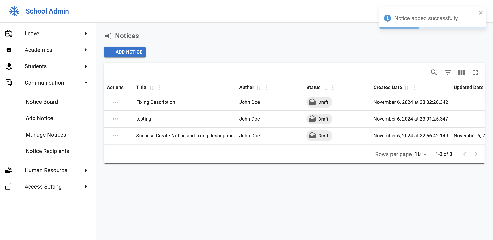

## Problem 1: Fix "Add New Notice" Page

### Issue Description

On the "Add New Notice" page (`/app/notices/add`), when the 'Save' button is clicked, the `description` is not being saved correctly.

### Fix Applied

1. **File Fixed**: `src/domains/notice/components/notice-form.tsx`

   - Changed the property name from `content` to `description` on line 89 to align with the backend field and form state.

2. **File Fixed**: `src/domains/notice/pages/add-notice-page.tsx`
   - Adjusted the `initialState.content` to `initialState.description` to ensure the initial form state matches the updated property in the form component.

### Outcome

Now, when the 'Save' button is clicked, the `description` is correctly saved.
